# Lumina Architecture Diagrams

This document contains all system architecture diagrams for the Lumina Photo Gallery application.

---

## 1. High-Level System Architecture

```mermaid
flowchart TB
    subgraph Client["🌐 Client Layer"]
        Browser["Web Browser<br/>(app.html)"]
    end

    subgraph Server["🖥️ Application Layer"]
        Flask["Flask App<br/>(Gunicorn)"]
        Routes["API Routes<br/>(lumina/routes.py)"]
        Storage["Storage Layer<br/>(storage.py)"]
    end

    subgraph Data["💾 Data Layer"]
        MySQL[(MySQL<br/>Users & Friends)]
        DynamoDB[(DynamoDB<br/>Photos & Messages)]
        S3[(S3 Bucket<br/>Image Files)]
    end

    Browser -->|HTTP/REST| Flask
    Flask --> Routes
    Routes --> Storage
    Storage -->|User Data| MySQL
    Storage -->|Metadata| DynamoDB
    Storage -->|Images| S3
```



---

## 2. AWS Cloud Architecture

```mermaid
flowchart TB
    subgraph Internet["☁️ Internet"]
        User["👤 User"]
    end

    subgraph AWS["AWS Cloud"]
        subgraph VPC["VPC"]
            subgraph Public["Public Subnet"]
                EC2["EC2 Instance<br/>t2.micro<br/>Flask + Gunicorn"]
            end
            subgraph Private["Private Subnet"]
                RDS["RDS MySQL<br/>db.t3.micro<br/>User Accounts"]
            end
        end
        
        DynamoDB["DynamoDB<br/>Photos, Comments,<br/>Likes, Messages"]
        S3["S3 Bucket<br/>Full Images<br/>Thumbnails"]
    end

    User -->|Port 8080| EC2
    EC2 -->|Port 3306| RDS
    EC2 -->|HTTPS| DynamoDB
    EC2 -->|HTTPS| S3
```



---

## 3. Data Flow - Photo Upload


---

## 4. Data Flow - User Authentication


---

## 5. Data Flow - Social Features


---

## 6. DynamoDB Data Model

```mermaid
erDiagram
    PHOTO {
        string PK "PHOTO#{photo_id}"
        string SK "META"
        string user_id
        string caption
        string timestamp
        list likes
        string s3_key
        string thumb_key
    }
    
    COMMENT {
        string PK "PHOTO#{photo_id}"
        string SK "COMMENT#{timestamp}#{user_id}"
        string user_id
        string username
        string text
        string timestamp
    }
    
    MESSAGE {
        string PK "CHAT#{user1}#{user2}"
        string SK "MSG#{timestamp}"
        string sender_id
        string text
        string timestamp
    }
    
    USER_INDEX {
        string PK "USER#{user_id}"
        string SK "PHOTO#{photo_id}"
        string photo_id
        string timestamp
    }

    PHOTO ||--o{ COMMENT : has
    PHOTO ||--o{ USER_INDEX : indexed_by
```

---

## 7. MySQL Data Model


---

## 8. Application Module Structure


---

## 9. API Endpoint Map


---

## 10. Docker Local Deployment


---

## 11. Request Lifecycle


---

## 12. Image Processing Pipeline

```mermaid
flowchart LR
    A[Original Image] --> B[Pillow Load]
    B --> C{Size Check}
    C -->|Width > 1200| D[Resize Full<br/>max 1200px]
    C -->|Width ≤ 1200| E[Keep Original]
    D --> F[Create Thumbnail<br/>300x300]
    E --> F
    F --> G[Convert to JPEG]
    G --> H[Upload to S3]
    H --> I[Store Keys in DynamoDB]
```



---

## How to View These Diagrams

### Option 1: GitHub
GitHub automatically renders Mermaid diagrams in markdown files.

### Option 2: VS Code
Install the "Markdown Preview Mermaid Support" extension.

### Option 3: Online
Copy the mermaid code to [mermaid.live](https://mermaid.live)

### Option 4: Export to PNG
Use [mermaid-cli](https://github.com/mermaid-js/mermaid-cli):
```bash
npm install -g @mermaid-js/mermaid-cli
mmdc -i ARCHITECTURE.md -o architecture.png
```
