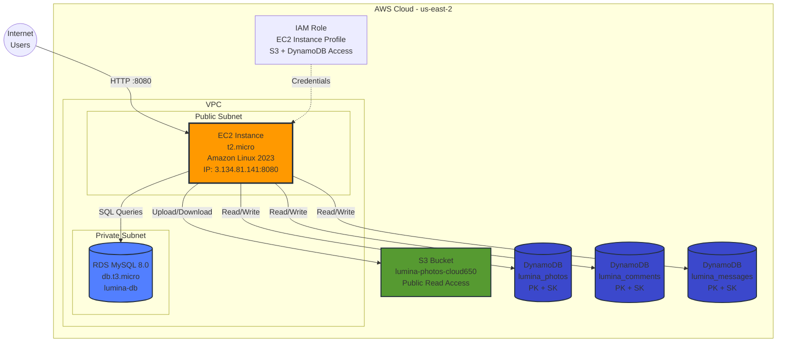
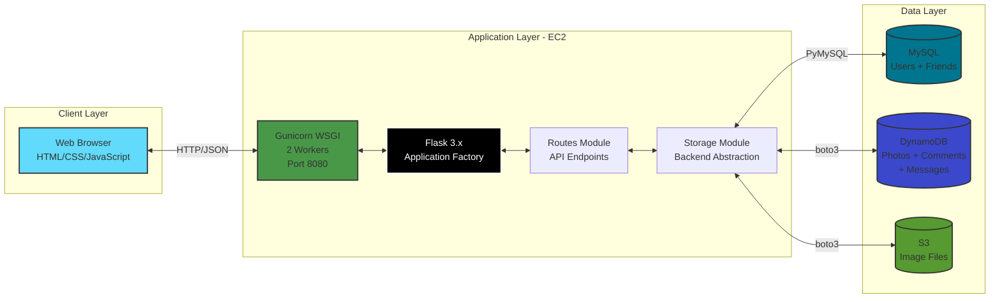
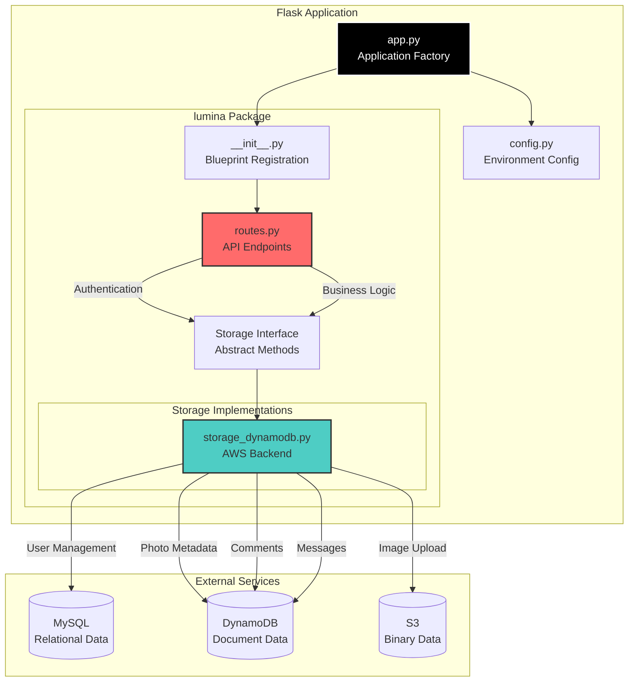
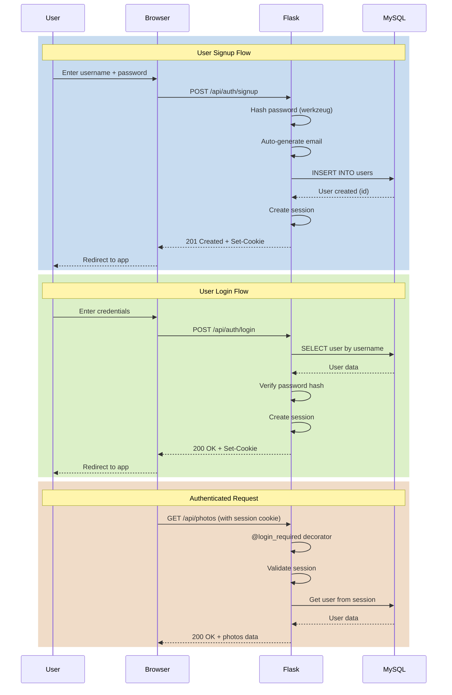
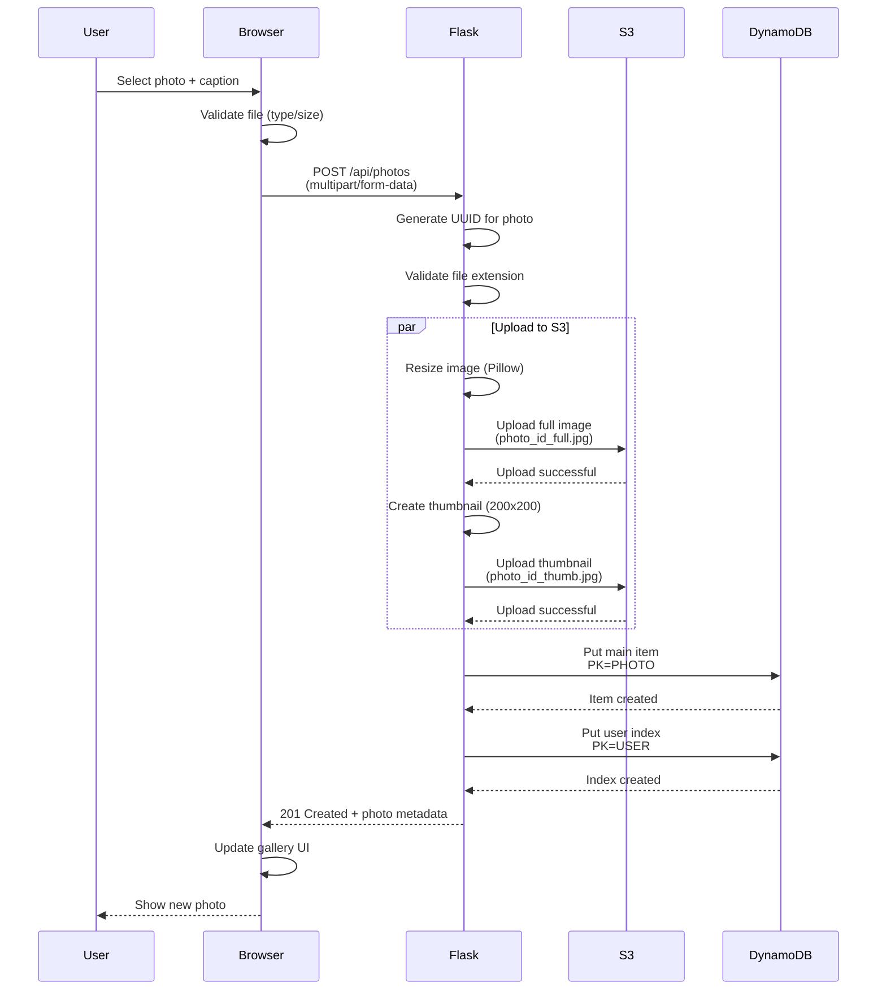
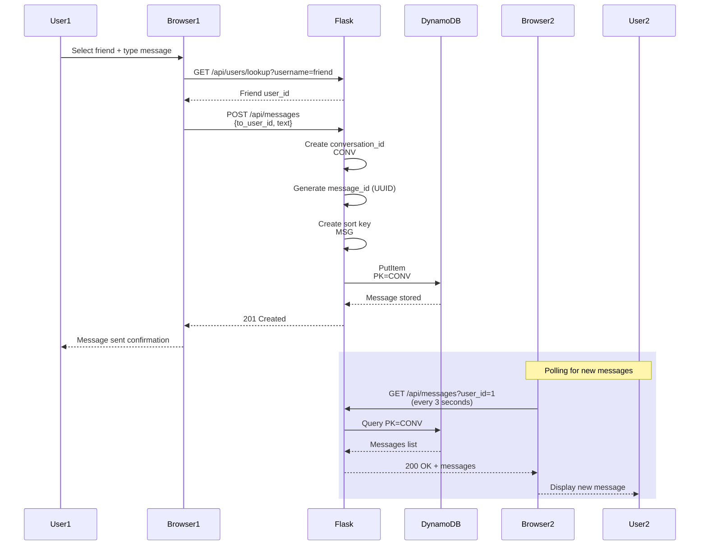
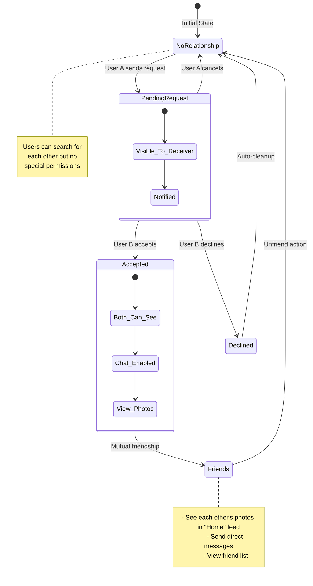
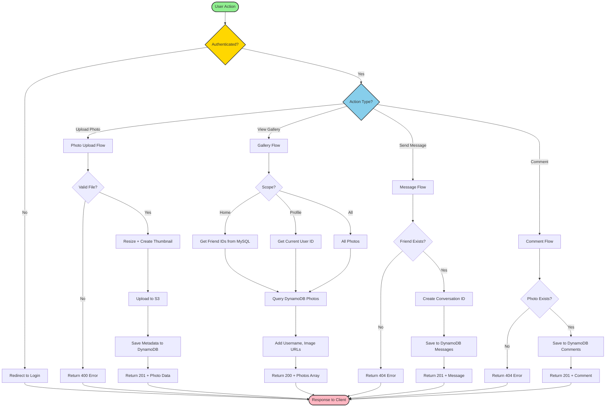
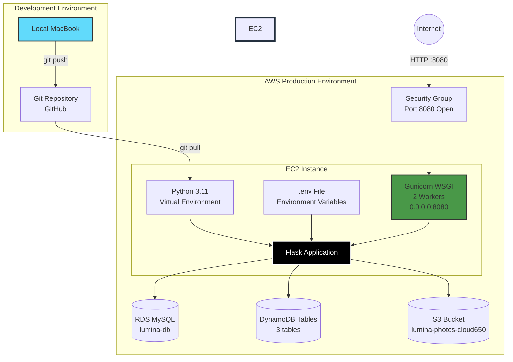

# Lumina - Architecture & Design Documentation

This document contains comprehensive architecture diagrams for the Lumina photo-sharing application deployed on AWS.

## Table of Contents
1. [AWS Infrastructure Architecture](#1-aws-infrastructure-architecture)
2. [System Architecture Overview](#2-system-architecture-overview)
3. [Backend Architecture](#3-backend-architecture)
4. [Frontend Architecture](#4-frontend-architecture)
5. [Database Schema Design](#5-database-schema-design)
6. [Authentication Flow](#6-authentication-flow)
7. [Photo Upload Flow](#7-photo-upload-flow)
8. [Messaging System Flow](#8-messaging-system-flow)
9. [Friend Request Flow](#9-friend-request-flow)
10. [Data Flow Architecture](#10-data-flow-architecture)
11. [API Request Flow](#11-api-request-flow)
12. [Deployment Architecture](#12-deployment-architecture)

---

## 1. AWS Infrastructure Architecture



**Key Components:**
- **EC2**: Application server running Gunicorn with Flask
- **RDS MySQL**: User accounts and friendship relationships
- **S3**: Photo storage (full resolution + thumbnails)
- **DynamoDB**: Photos metadata, comments, and messages
- **IAM**: Secure access control for AWS services

---

## 2. System Architecture Overview



**Architecture Pattern**: Three-tier architecture with clear separation of concerns
- **Presentation**: HTML/CSS/JavaScript frontend
- **Application**: Flask backend with modular design
- **Data**: Hybrid storage (SQL + NoSQL + Object Storage)

---

## 3. Backend Architecture



**Backend Modules:**
- **app.py**: Entry point, Flask app factory
- **routes.py**: 15+ RESTful API endpoints
- **storage_dynamodb.py**: 30+ methods for data operations
- **config.py**: Environment-based configuration

---

## 4. Frontend Architecture

```mermaid
graph TB
    subgraph "Static HTML Pages"
        Index[index.html<br/>Landing Page]
        AppHTML[app.html<br/>Main Application]
    end
    
    subgraph "JavaScript Modules - Embedded in app.html"
        API[API Layer<br/>fetch() wrapper]
        Auth[Authentication<br/>Session Management]
        PhotoUI[Photo Management<br/>Upload/Display/Delete]
        CommentUI[Comments UI<br/>Add/View Comments]
        MessageUI[Messaging UI<br/>Real-time Chat]
        FriendsUI[Friends UI<br/>Requests/List]
        Gallery[Gallery Views<br/>Home/Profile/All]
    end
    
    subgraph "UI Components"
        Modal[Modal Dialogs<br/>Upload/Comments/Messages]
        Tabs[Tab Navigation<br/>Home/Profile/All/Friends/Chat]
        Cards[Photo Cards<br/>Grid Layout]
    end
    
    Index -->|Login/Signup| API
    AppHTML --> Auth
    AppHTML --> Gallery
    AppHTML --> Tabs
    
    Auth --> API
    PhotoUI --> API
    CommentUI --> API
    MessageUI --> API
    FriendsUI --> API
    
    Gallery --> PhotoUI
    Tabs --> Gallery
    Tabs --> FriendsUI
    Tabs --> MessageUI
    
    PhotoUI --> Modal
    CommentUI --> Modal
    MessageUI --> Modal
    Gallery --> Cards
    
    API -->|HTTP Requests| Backend[Flask Backend API]
    
    style AppHTML fill:#61dafb,stroke:#333,stroke-width:2px
    style API fill:#ff6b6b,stroke:#333,stroke-width:2px
    style Auth fill:#ffd93d,stroke:#333,stroke-width:2px
    style Backend fill:#6bcf7f,stroke:#333,stroke-width:2px
```

**Frontend Features:**
- Single Page Application (SPA) architecture
- RESTful API integration
- Session-based authentication
- Responsive grid layout
- Modal-based interactions

---

## 5. Database Schema Design

```mermaid
erDiagram
    USERS ||--o{ FRIEND_REQUESTS : creates
    USERS ||--o{ FRIEND_REQUESTS : receives
    USERS ||--o{ PHOTOS : uploads
    PHOTOS ||--o{ COMMENTS : has
    USERS ||--o{ MESSAGES : sends
    USERS ||--o{ MESSAGES : receives
    
    USERS {
        int id PK
        varchar username UK
        varchar email UK
        varchar password_hash
        timestamp created_at
    }
    
    FRIEND_REQUESTS {
        int id PK
        int requester_id FK
        int receiver_id FK
        enum status
        timestamp created_at
    }
    
    PHOTOS {
        string PK "PHOTO#id"
        string SK "META or USER#id"
        string photo_id
        int user_id
        string username
        string caption
        string full_key
        string thumbnail_key
        int likes
        timestamp created_at
    }
    
    COMMENTS {
        string PK "PHOTO#photo_id"
        string SK "COMMENT#timestamp#id"
        string comment_id
        string photo_id
        int user_id
        string username
        string text
        timestamp created_at
    }
    
    MESSAGES {
        string PK "CONV#user1#user2"
        string SK "MSG#timestamp#id"
        string message_id
        string conversation_id
        int from_user_id
        string from_username
        int to_user_id
        string text
        timestamp timestamp
    }
```

**Storage Strategy:**
- **MySQL (RDS)**: Users and friend relationships (ACID compliance)
- **DynamoDB**: Photos, comments, messages (scalability and performance)
- **S3**: Image files (cost-effective object storage)

**DynamoDB Key Design:**
- **Photos**: `PK=PHOTO#{id}, SK=META` (main item) + `PK=USER#{user_id}, SK=PHOTO#{id}` (index)
- **Comments**: `PK=PHOTO#{photo_id}, SK=COMMENT#{timestamp}#{id}`
- **Messages**: `PK=CONV#{user1}#{user2}, SK=MSG#{timestamp}#{id}`

---

## 6. Authentication Flow



**Security Features:**
- Password hashing with werkzeug.security
- Session-based authentication (Flask sessions)
- Decorator-based route protection
- Automatic email generation for compatibility

---

## 7. Photo Upload Flow



**Image Processing:**
- Original image stored as-is
- Thumbnail generated at 200x200px
- JPEG compression for optimization
- Unique S3 keys: `{uuid}_full.jpg` and `{uuid}_thumb.jpg`

---

## 8. Messaging System Flow



**Messaging Features:**
- Conversation-based storage (sorted users for consistency)
- Chronological ordering via timestamp in sort key
- Polling-based message retrieval (3-second intervals)
- Efficient queries using composite keys

---

## 9. Friend Request Flow



**Friend Request Process:**
1. **Send Request**: POST /api/friends/request
2. **View Requests**: GET /api/friends/requests
3. **Accept/Decline**: POST /api/friends/respond
4. **View Friends**: GET /api/friends/list

---

## 10. Data Flow Architecture



---

## 11. API Request Flow

```mermaid
graph TB
    Request[HTTP Request] --> Gunicorn[Gunicorn Worker]
    Gunicorn --> Flask[Flask App]
    Flask --> Route{Route Exists?}
    
    Route -->|No| NotFound[404 Not Found]
    Route -->|Yes| AuthCheck{@login_required?}
    
    AuthCheck -->|Yes| Session{Valid Session?}
    AuthCheck -->|No| Handler[Route Handler]
    
    Session -->|No| Unauthorized[401 Unauthorized]
    Session -->|Yes| Handler
    
    Handler --> Business[Business Logic]
    Business --> Storage[Storage Layer]
    
    Storage --> DataSource{Data Source?}
    
    DataSource -->|Users/Friends| MySQL[(MySQL Query)]
    DataSource -->|Photos/Comments| DynamoDB[(DynamoDB Query)]
    DataSource -->|Images| S3[(S3 Get/Put)]
    
    MySQL --> Process[Process Results]
    DynamoDB --> Process
    S3 --> Process
    
    Process --> Response{Success?}
    
    Response -->|Yes| Success[200/201 + JSON]
    Response -->|No| Error[400/500 + Error Message]
    
    Success --> Return[HTTP Response]
    Error --> Return
    NotFound --> Return
    Unauthorized --> Return
    
    Return --> Gunicorn
    Gunicorn --> Client[Client Browser]
    
    style Request fill:#61dafb,stroke:#333,stroke-width:2px
    style Flask fill:#000,stroke:#fff,stroke-width:2px,color:#fff
    style MySQL fill:#00758f,stroke:#333,stroke-width:2px
    style DynamoDB fill:#3b48cc,stroke:#333,stroke-width:2px
    style S3 fill:#569a31,stroke:#333,stroke-width:2px
    style Client fill:#90EE90,stroke:#333,stroke-width:2px
```

**API Endpoints (15 total):**

**Authentication:**
- POST /api/auth/signup
- POST /api/auth/login
- POST /api/auth/logout
- GET /api/auth/me

**Photos:**
- POST /api/photos
- GET /api/photos (with scope parameter)
- DELETE /api/photos/:id
- GET /api/photos/:id/image/:size
- POST /api/photos/:id/like

**Comments:**
- GET /api/photos/:id/comments
- POST /api/photos/:id/comments

**Friends:**
- POST /api/friends/request
- GET /api/friends/requests
- POST /api/friends/respond

**Messages:**
- GET /api/messages
- POST /api/messages

**Users:**
- GET /api/users/lookup

---

## 12. Deployment Architecture



**Deployment Steps:**
1. **Local Development**: Code changes on MacBook
2. **Version Control**: Push to GitHub repository
3. **EC2 Deployment**: Pull latest code on EC2 instance
4. **Environment Setup**: Configure .env with AWS credentials
5. **Process Management**: Restart Gunicorn workers
6. **Service Access**: Application available at http://3.134.81.141:8080

**Environment Variables:**
```bash
STORAGE_BACKEND=dynamodb
AWS_REGION=us-east-2
S3_BUCKET=lumina-photos-cloud650
DYNAMODB_PHOTOS_TABLE=lumina_photos
DYNAMODB_COMMENTS_TABLE=lumina_comments
DYNAMODB_MESSAGES_TABLE=lumina_messages
DB_HOST=lumina-db.cd0acqgy60av.us-east-2.rds.amazonaws.com
DB_USER=admin
DB_PASSWORD=***
DB_NAME=lumina
```

---

## Technology Stack Summary

### Frontend
- **HTML5/CSS3**: Responsive layout
- **Vanilla JavaScript**: DOM manipulation, fetch API
- **No Frameworks**: Lightweight, fast loading

### Backend
- **Flask 3.x**: Web framework
- **Gunicorn 23.0.0**: WSGI server (2 workers)
- **Python 3.11**: Runtime environment
- **PyMySQL**: MySQL database driver
- **boto3 1.28+**: AWS SDK for Python
- **Pillow**: Image processing library

### Data Storage
- **MySQL 8.0**: User accounts, friendships (RDS db.t3.micro)
- **DynamoDB**: Photos, comments, messages (on-demand billing)
- **S3**: Image file storage (standard storage class)

### Infrastructure
- **EC2**: t2.micro Amazon Linux 2023
- **VPC**: Default VPC with public/private subnets
- **Security Groups**: Port 8080 (HTTP) open to 0.0.0.0/0
- **IAM**: Instance profile with S3 and DynamoDB permissions

### Development Tools
- **Git/GitHub**: Version control
- **SSH**: Remote server access
- **vim/nano**: Server-side editing

---

## Cost Optimization

**AWS Free Tier Usage:**
- ✅ EC2 t2.micro (750 hours/month)
- ✅ RDS db.t3.micro (750 hours/month, 20GB storage)
- ✅ S3 (5GB storage, 20,000 GET, 2,000 PUT)
- ✅ DynamoDB (25GB storage, 25 WCU, 25 RCU)

**Estimated Monthly Cost**: $0 (within Free Tier limits)

---

## Performance Characteristics

- **Photo Upload**: ~2-3 seconds (includes resizing + S3 upload)
- **Gallery Load**: ~500ms-1s (optimized single scan query)
- **Message Delivery**: ~3 seconds (polling interval)
- **Authentication**: ~200ms (MySQL query + session creation)
- **API Response Time**: Avg 300ms (excluding S3 image delivery)

---

## Scalability Considerations

**Current Bottlenecks:**
1. Single EC2 instance (no horizontal scaling)
2. Polling-based messaging (not real-time)
3. Gunicorn with only 2 workers

**Future Improvements:**
1. **Add Load Balancer**: Distribute traffic across multiple EC2 instances
2. **Implement WebSockets**: Real-time messaging with Socket.IO
3. **Add CloudFront CDN**: Cache S3 images globally
4. **Use ElastiCache**: Session store and query caching
5. **Implement Auto Scaling**: Dynamic EC2 scaling based on load
6. **Add API Gateway**: Rate limiting and request throttling

---

**Last Updated**: November 25, 2025  
**Version**: 1.0  
**Author**: Lumina Development Team
